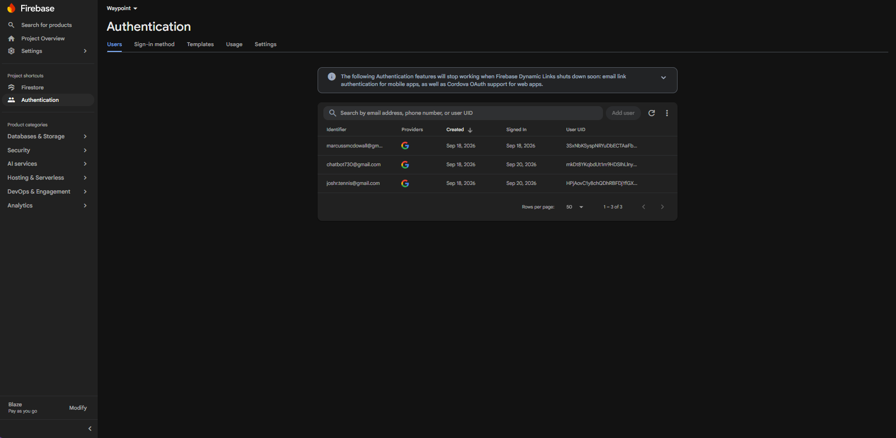
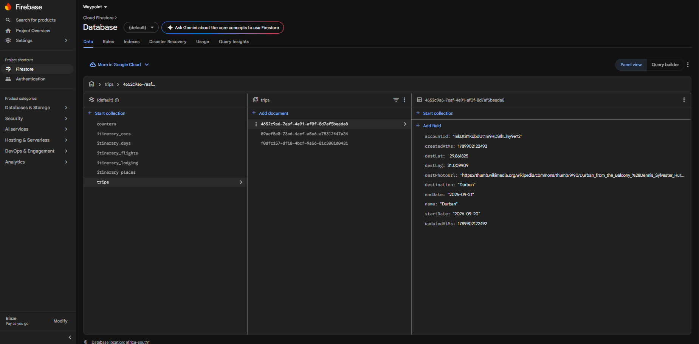
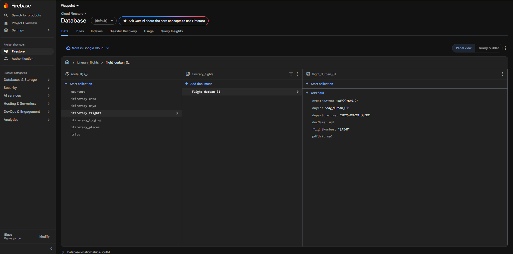
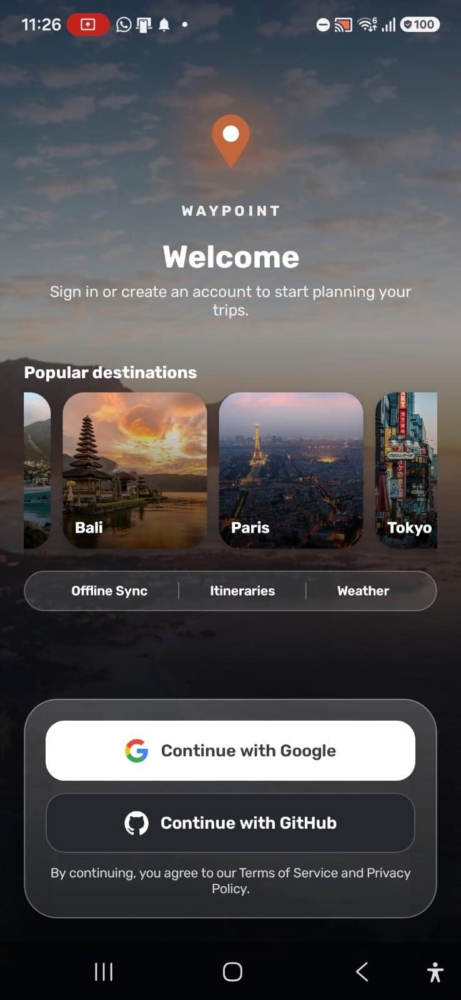
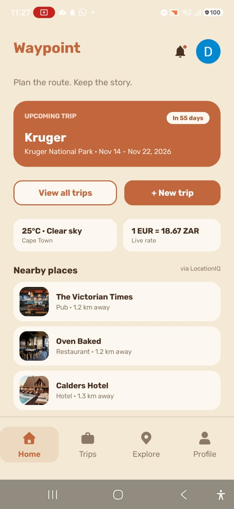
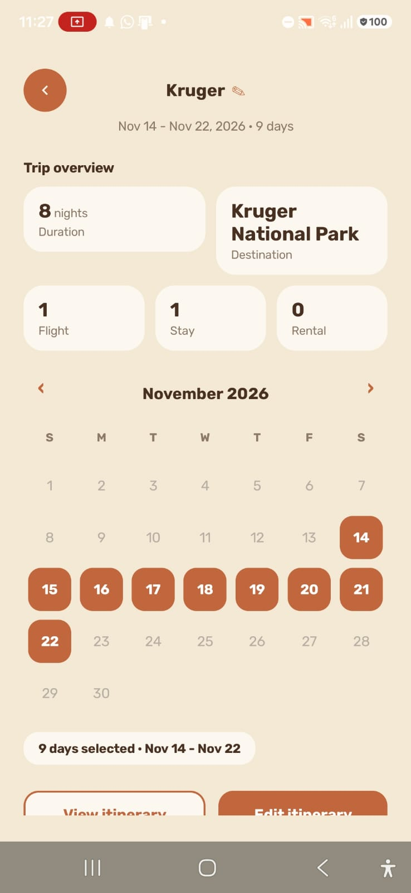
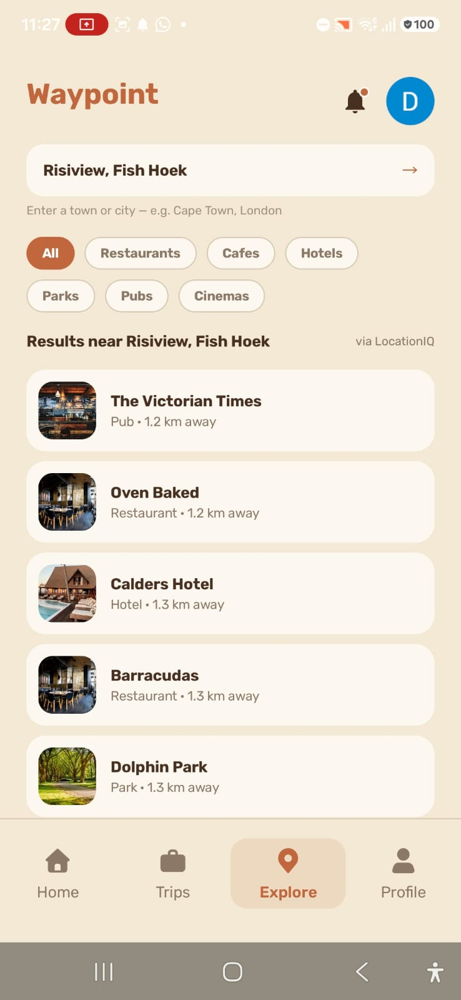

# Waypoint

> A travel itinerary planner for Android built with Kotlin, Jetpack Compose, and real-time API data.

[](https://github.com/JoshRobertsZA/PROG7314/actions/workflows/android-ci.yml)

[](https://github.com/JoshRobertsZA)
[](https://github.com/ST10438409-Emeris)
[](https://github.com/GraceBerrill)
[](https://github.com/ST10356369)

### Submission Links

[](https://prog7314-git-287180570190.africa-south1.run.app/docs) &nbsp; [](https://youtu.be/kx_R5qv70TE)

The Swagger page is public and needs no setup - it documents all 25 endpoints and can
call them live. `GET /health` and `GET /counter/{key}` work straight away; every other
endpoint requires a Firebase ID token and returns `401` without one. The raw
specification is at
[openapi.json](https://prog7314-git-287180570190.africa-south1.run.app/openapi.json).

---

## Contents

- [About](#about)
- [Features](#features)
- [Architecture](#architecture)
- [APIs Used](#apis-used)
- [Cloud Sync Architecture](#cloud-sync-architecture)
- [CI/CD and Deployment](#cicd-and-deployment)
  - [Android CI - GitHub Actions](#android-ci---github-actions)
  - [REST API - Google Cloud Run](#rest-api---google-cloud-run)
- [Cloud Data Verification](#cloud-data-verification)
- [Screenshots](#screenshots)
- [Demo Video](#demo-video)
- [Running the Project Locally](#running-the-project-locally)
- [AI Usage](#ai-usage)
- [References](#references)

---

## About

Waypoint lets travellers plan and manage trips from a single app. Users can build day-by-day itineraries, track live flight status, check local weather and currency rates, discover nearby places, and receive push notifications before departure. Trip data is synced to the cloud via a dedicated REST API backed by Firestore, and is also stored locally in a SQLite database so the app works offline.

---

## Features

- **Google Sign-In**: Biometric lock for returning sessions
- **Trip management**: Create, edit, and delete trips with date ranges and destinations
- **Day-by-day itinerary builder**: Flight tracking (AirLabs) per leg
- **Explore nearby**: Points of interest powered by LocationIQ
- **Live weather**: Displayed for any destination via OpenWeatherMap
- **Currency converter**: Using real-time rates from ExchangeRate-API
- **Wikipedia summaries**: Used for destinations and places
- **Push notifications**: Via Firebase Cloud Messaging with WorkManager scheduling
- **Cloud sync**: Offline-first with local SQLite as source of truth; trips sync to cloud via REST API on every create, update, and delete, and are pulled back on login to restore data on new or wiped devices
- **Multi-language support**: English (default), isiZulu, isiXhosa
- **GitHub Actions CI**: Automated lint, unit tests, and APK build on every push

---

## Architecture

| Layer | Technology |
|---|---|
| Language | Kotlin |
| UI | Jetpack Compose |
| Pattern | MVVM (ViewModel + StateFlow) |
| Local database | SQLite via `SQLiteOpenHelper` |
| Cloud sync | Custom REST API (Node.js) hosted on Google Cloud Run |
| Cloud database | Firebase Firestore (via REST API, not directly from app) |
| Authentication | Firebase Auth (Google SSO) + BiometricPrompt |
| Push notifications | Firebase Cloud Messaging + WorkManager |
| HTTP client | OkHttp |
| Async | Kotlin Coroutines |
| Build | Gradle (Kotlin DSL) |

API keys are fetched at runtime from a private GitHub repository via `core/secrets/RemoteSecrets.kt` and held in memory only; they are never stored on disk.

---

## APIs Used

| API | Purpose |
|---|---|
| [AirLabs](https://airlabs.co/) | Real-time flight status and schedule lookup by flight number |
| [OpenWeatherMap](https://openweathermap.org/api) | Current weather and forecasts for trip destinations |
| [ExchangeRate-API](https://www.exchangerate-api.com/) | Live currency exchange rates for the in-app converter |
| [LocationIQ](https://locationiq.com/) | Reverse geocoding and nearby points-of-interest search |
| [Wikipedia REST API](https://en.wikipedia.org/api/rest_v1/) | City and place summaries displayed on destination cards |
| [GitHub Contents API](https://docs.github.com/en/rest/repos/contents) | Secure remote fetch of API keys at runtime |
| [CounterAPI](https://counterapi.dev/) | Anonymous usage counter for place search events |
| [Firebase Cloud Messaging](https://firebase.google.com/docs/cloud-messaging) | Push notifications for trip reminders |
| [Waypoint REST API](https://prog7314-git-287180570190.africa-south1.run.app) | Custom Cloud Run API for trip CRUD and cloud sync |

---

## Cloud Sync Architecture

The app follows an offline-first pattern:

1. Every trip write (create, update, delete) hits SQLite immediately so the UI never waits on the network
2. After the SQLite write succeeds, the app fires a background coroutine to sync the change to the Waypoint REST API
3. On login, the app pulls all cloud trips and merges them into SQLite using `CONFLICT_IGNORE` so local data is never overwritten
4. The REST API authenticates every request using the user's Firebase ID token

This means the app works fully offline and data is restored automatically when signing in on a new or wiped device.

---

## CI/CD and Deployment

Two pipelines: automated continuous integration for the Android app, and container
deployment for the REST API.

### Android CI - GitHub Actions

Every push and pull request to `main` or `dev` triggers three parallel jobs on
`ubuntu-latest` with JDK 17 and a cached Gradle setup:

1. **Lint** - runs `./gradlew lintDebug` and uploads the HTML report as an artifact
2. **Unit Tests** - runs `./gradlew testDebugUnitTest`, uploads the XML results, and
   publishes a pass/fail summary as a PR check
3. **Build** - runs `./gradlew assembleDebug` and uploads the debug APK as an artifact

A `concurrency` group cancels superseded runs so only the newest commit on a branch is
tested. A Discord webhook posts a per-job status update and a final summary, so the team
is notified without checking GitHub. The workflow can also be triggered manually via
`workflow_dispatch`.

CI configuration: [`.github/workflows/android-ci.yml`](.github/workflows/android-ci.yml)

**Unit tests:** 22 JUnit tests covering local persistence models, cache staleness rules,
and pure business logic. Run locally with `./gradlew testDebugUnitTest`; results land in
`app/build/reports/tests/testDebugUnitTest/`, the same report CI uploads as the
`unit-test-report` artifact.

<details>
<summary>Test class breakdown</summary>

| Test class | What it covers |
|---|---|
| [`TripEntityTest`](app/src/test/java/com/waypoint/app/TripEntityTest.kt) | Trip entity creation, chronological date sorting, nullable destination handling |
| [`ItineraryEntitiesTest`](app/src/test/java/com/waypoint/app/ItineraryEntitiesTest.kt) | Itinerary day, flight, lodging/car rental, and place entity initialization |
| [`CacheModelsTest`](app/src/test/java/com/waypoint/app/CacheModelsTest.kt) | Weather, currency, and places cache staleness thresholds |
| [`WeatherRepositoryTest`](app/src/test/java/com/waypoint/app/WeatherRepositoryTest.kt) | City-name-to-slug conversion for weather lookups |
| [`ExplorePlaceFilterTest`](app/src/test/java/com/waypoint/app/ExplorePlaceFilterTest.kt) | Category filtering (restaurants, parks, all) on Explore results |
| [`AppLanguageTest`](app/src/test/java/com/waypoint/app/AppLanguageTest.kt) | Supported locale tags and display names |
| [`ExampleUnitTest`](app/src/test/java/com/waypoint/app/ExampleUnitTest.kt) | Default Android Studio template test |

</details>

### REST API - Google Cloud Run

The API in [`api/`](api/) is containerised and deployed to Cloud Run:

```bash
gcloud run deploy prog7314-git --source api --region africa-south1
```

This builds the [`api/Dockerfile`](api/Dockerfile) (a slim Node 20 image installing
production dependencies only), pushes the image to Artifact Registry tagged with the
current Git commit SHA, and rolls out a new revision.

| Setting | Value |
|---|---|
| Service | `prog7314-git` |
| Region | `africa-south1` (Johannesburg, lowest latency for South African users) |
| Resources | 1 vCPU, 512 MiB |
| Scaling | 0 to 20 instances - scales to zero when idle |
| Credentials | Secret Manager secret `firebase-secret`, injected at runtime as `FIREBASE_SERVICE_ACCOUNT` |
| Ingress | Public, with authorisation enforced per-request by Firebase ID token |

Two properties worth noting. The Firestore service account key is never in the
repository or the container image - Cloud Run injects it from Secret Manager at runtime,
so it can be rotated without a code change. And because each image is tagged with the
commit it was built from, every running revision traces back to an exact point in the
source history; Cloud Run retains previous revisions, so a bad deploy is rolled back by
shifting traffic rather than rebuilding.

API deployment is run manually rather than from GitHub Actions, which keeps a deliberate
gate between merging code and changing the live service the app depends on.

---

## Cloud Data Verification

The demonstration video covers the app and the REST API layer. This section covers the
other end of the pipeline: the hosted authentication service and the Firestore database,
showing that data written in the app is captured and modified in the cloud.

### Firebase Authentication

Users signing in with Google SSO appear in the Firebase Authentication user table. Each
user's UID is the `accountId` written onto every trip, which is how the API scopes data
to its owner.



### Firestore - trips collection

Trips created in the app are written to Firestore through the REST API. The `accountId`
field matches the signed-in user's Firebase UID, and no document can be read or written
by another account.



### Firestore - itinerary collections

The API also exposes itinerary endpoints backed by their own collections, linked by
`tripId` and `dayId`: `itinerary_days`, `itinerary_flights`, `itinerary_lodging`,
`itinerary_cars` and `itinerary_places`. Each enforces the same ownership check by
resolving the parent trip's `accountId` before any read or write.

These records are written through the REST API. In the current build the Android app
syncs trips to the cloud and keeps itinerary detail in local SQLite, so the collections
below were populated by calling the documented endpoints directly.



---

## Screenshots

| Welcome | Home | Itinerary | Explore |
|---|---|---|---|
|  |  |  |  |

*(Screenshots captured on a physical Android device)*

---

## Demo Video

[Watch on YouTube](https://youtu.be/kx_R5qv70TE)

The video walks through: signing in, creating a trip, adding itinerary days and flights, exploring nearby places, checking weather and currency, and receiving a push notification.

---

## Running the Project Locally

1. Clone the repo
   ```
   git clone <<URL>>
   ```
2. Add your `google-services.json` from the Firebase console into `app/`
3. Open the project in Android Studio Hedgehog or later
4. Run on a physical device (API 26+) or an emulator

> API keys are fetched at runtime from a private GitHub repository via the GitHub Contents API and held in memory only. No local key file is required.

---
## AI Usage

AI coding assistants were used selectively during development, in a bounded set of tasks
that are listed explicitly below. Every use was reviewed, tested, and understood by a
team member before being committed — nothing generated by an AI tool was merged without
that check.

### Tools Used

- [Gemini](https://developer.android.com/studio/gemini/overview) - inline code completion in the IDE
- [Anthropic Claude](https://www.anthropic.com/claude) - used via [Claude Code](https://claude.com/claude-code) for larger, multi-file tasks

### What AI was used for

- **Boilerplate generation** - ViewModel scaffolding, Compose layout templates, unit test stubs
- **Debugging assistance** - diagnosing OkHttp response parsing failures
- **README authoring** - structuring and drafting sections of this document

### Human review process

Every AI-assisted change went through the same path as hand-written code before landing
on `main`:

1. The suggestion was read and understood by a team member, not accepted blindly
2. It was tested locally (unit tests, manual run, or both depending on the change)
3. It was committed under a team member's own authorship and judgment, not merged automatically
4. It still passed the same [CI pipeline](https://github.com/JoshRobertsZA/PROG7314/actions) - lint, unit tests, and build - as every other change
5. At the end of the day, we as students are learning new things every day, the AI use encouraged us to go beyond the POE and learn new things

### What AI was *not* used for

- UI/UX design decisions
- Architecture or technology choices (MVVM, offline-first sync design, API selection)
- Business logic correctness -  AI-suggested logic was implemented and verified by the team, not trusted as-is
- Any assessment submission content outside of code (this README's factual claims, screenshots, and demo video are the team's own work)

In short: AI tools sped up mechanical, low-risk work (scaffolding, comments, boilerplate)
and served as a debugging aid. Every decision that shaped how the app works was made and
owned by the team.

---

## References

AirLabs (n.d.) *AirLabs Flight API documentation*. Available at: https://airlabs.co/docs (Accessed: 19 September 2026).

Android Developers (2024) *Guide to app architecture*. Available at: https://developer.android.com/topic/architecture (Accessed: 1 September 2026).

Android Developers (2024) *Jetpack Compose documentation*. Available at: https://developer.android.com/jetpack/compose/documentation (Accessed: 2 September 2026).

Android Developers (2024) *SQLiteOpenHelper*. Available at: https://developer.android.com/reference/android/database/sqlite/SQLiteOpenHelper (Accessed: 16 September 2026).

Android Developers (2024) *Schedule tasks with WorkManager*. Available at: https://developer.android.com/topic/libraries/architecture/workmanager (Accessed: 18 September 2026).

Android Developers (2024) *Show a biometric authentication dialog*. Available at: https://developer.android.com/training/sign-in/biometric-auth (Accessed: 18 September 2026).

Android Developers (2024) *Sign in your user with Credential Manager*. Available at: https://developer.android.com/identity/sign-in/credential-manager (Accessed: 18 September 2026).

CounterAPI (n.d.) *CounterAPI documentation*. Available at: https://counterapi.dev/ (Accessed: 17 September 2026).

ExchangeRate-API (n.d.) *ExchangeRate-API documentation*. Available at: https://www.exchangerate-api.com/docs (Accessed: 9 September 2026).

GeeksforGeeks (2023) *Google authentication with Firebase*. Available at: https://www.geeksforgeeks.org/firebase/google-authentication-with-firebase/ (Accessed: 3 September 2026).

GitHub (2024) *REST API endpoints for repository contents*. Available at: https://docs.github.com/en/rest/repos/contents (Accessed: 17 September 2026).

GitHub (2024) *GitHub Actions documentation*. Available at: https://docs.github.com/en/actions (Accessed: 18 September 2026).

Google (2024) *Firebase Authentication for Android*. Available at: https://firebase.google.com/docs/auth/android/start (Accessed: 4 September 2026).

Google (2023) *Build an Android app with Firebase and Jetpack Compose* (codelab). Available at: https://firebase.google.com/codelabs/build-android-app-with-firebase-compose (Accessed: 5 September 2026).

Google (2024) *Get started with Cloud Firestore on Android*. Available at: https://firebase.google.com/docs/firestore/quickstart (Accessed: 17 September 2026).

Google (2024) *Cloud Firestore security rules*. Available at: https://firebase.google.com/docs/firestore/security/get-started (Accessed: 19 September 2026).

Google (2024) *Cloud Firestore REST API*. Available at: https://firebase.google.com/docs/firestore/use-rest-api (Accessed: 19 September 2026).

Google (2024) *Firebase Cloud Messaging documentation*. Available at: https://firebase.google.com/docs/cloud-messaging (Accessed: 18 September 2026).

Google Cloud (2024) *Cloud Run documentation*. Available at: https://cloud.google.com/run/docs (Accessed: 19 September 2026).

JUnit Team (2024) *JUnit 4*. Available at: https://junit.org/junit4/ (Accessed: 18 September 2026).

Kotlin (2024) *Coroutines overview*. Available at: https://kotlinlang.org/docs/coroutines-overview.html (Accessed: 17 September 2026).

LocationIQ (n.d.) *LocationIQ API documentation*. Available at: https://locationiq.com/docs (Accessed: 17 September 2026).

Muturia, E. (2023) *Firebase in Jetpack Compose: authentication & adding data to Cloud Firestore*. Medium. Available at: https://medium.com/@emmanuelmuturia/firebase-in-jetpack-compose-authentication-adding-data-to-cloud-firestore-a6a8e5ebee19 (Accessed: 6 September 2026).

OpenWeatherMap (n.d.) *OpenWeatherMap API documentation*. Available at: https://openweathermap.org/api (Accessed: 16 September 2026).

RapidDevelopers (n.d.) *How to use Firebase Auth with Google login*. Available at: https://www.rapidevelopers.com/firebase-tutorial/how-to-use-firebase-auth-with-google-login (Accessed: 7 September 2026).

Square (2024) *OkHttp documentation*. Available at: https://square.github.io/okhttp/ (Accessed: 17 September 2026).

Stackademic (2024) *Sign in with Google: Firebase Auth + Credential Manager in Jetpack Compose*. Available at: https://blog.stackademic.com/sign-in-with-google-firebase-auth-credential-manager-jetpack-compose-6e151a8c6825 (Accessed: 18 September 2026).

Swagger (2024) *OpenAPI Specification*. Available at: https://swagger.io/specification/ (Accessed: 20 September 2026).

Wikimedia Foundation (n.d.) *Wikipedia REST API*. Available at: https://en.wikipedia.org/api/rest_v1/ (Accessed: 17 September 2026).

YouTube (n.d.) *Video tutorial: Firebase Google Sign-In implementation in Android*. Available at: https://www.youtube.com/watch?v=u6lUQ2PmvgE (Accessed: 27 July 2026).

---

IIE Emeris - Cape Town | PROG7314 | 2026
